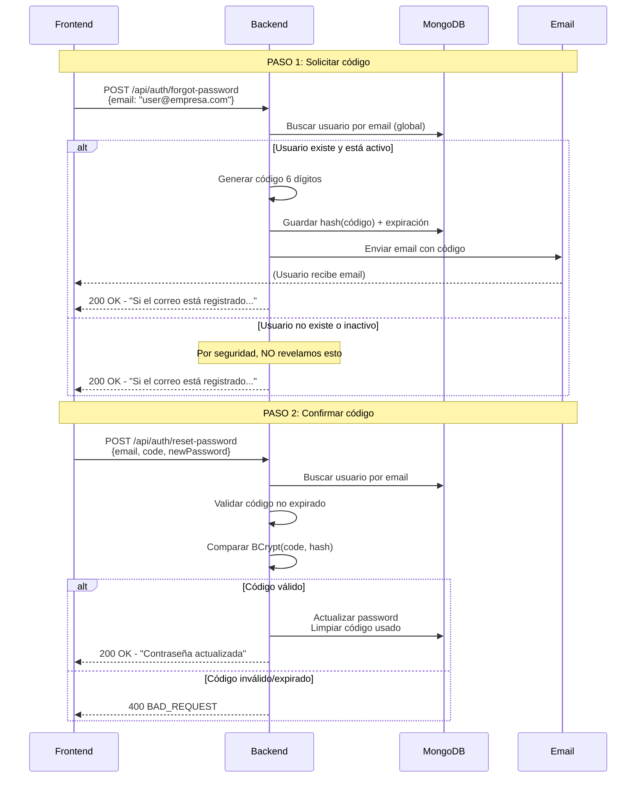

# 🔐 Flujo de Recuperación de Contraseña

## 📋 Resumen

Sistema de recuperación de contraseñas **sin dependencia de TenantContext** usando códigos numéricos de 6 dígitos enviados por email.

### ✅ Características

- ✅ **Endpoints públicos** - No requiere JWT ni header `X-Tenant`
- ✅ **Búsqueda global** - Encuentra usuarios por email sin necesidad de especificar organización
- ✅ **Códigos numéricos** - 6 dígitos fáciles de ingresar (100000-999999)
- ✅ **Seguridad BCrypt** - Los códigos se almacenan hasheados en BD
- ✅ **Expiración automática** - 15 minutos por defecto (configurable)
- ✅ **Prevención de enumeración** - Siempre retorna 200 OK aunque el usuario no exista
- ✅ **Email profesional** - Template HTML responsive con soporte dark mode
- ✅ **Uso único** - El código se limpia después de usarse

---

## 🔄 Flujo Completo



---

## 🛠️ Endpoints

### 1️⃣ POST `/api/auth/forgot-password`

Genera un código de 6 dígitos y lo envía al email del usuario.

#### Request

```http
POST /api/auth/forgot-password
Content-Type: application/json

{
  "email": "usuario@empresa.com"
}
```

#### Response (Siempre 200 OK)

```json
{
  "success": true,
  "message": "Si el correo está registrado, recibirás un código de recuperación en breve.",
  "errorCode": "reset_code_sent",
  "data": null
}
```

#### Validaciones

- ✅ Email requerido (`@NotBlank`)
- ✅ Email válido (`@Email`)
- ✅ Usuario debe existir en BD
- ✅ Usuario debe estar en estado `active`

#### Comportamiento Especial

⚠️ **Prevención de Enumeración de Usuarios**:
- Siempre retorna `200 OK` aunque el usuario no exista
- El frontend no puede saber si el email está registrado o no
- Esto previene ataques que intenten descubrir emails válidos

---

### 2️⃣ POST `/api/auth/reset-password`

Valida el código y actualiza la contraseña del usuario.

#### Request

```http
POST /api/auth/reset-password
Content-Type: application/json

{
  "email": "usuario@empresa.com",
  "code": "123456",
  "newPassword": "MiNuevaPassword123!"
}
```

#### Response Success (200 OK)

```json
{
  "success": true,
  "message": "Tu contraseña ha sido actualizada exitosamente. Ya puedes iniciar sesión.",
  "errorCode": "password_reset_success",
  "data": null
}
```

#### Response Error (400 BAD REQUEST)

```json
{
  "success": false,
  "message": "Código de recuperación inválido",
  "errorCode": "reset_code_invalid",
  "data": null
}
```

#### Validaciones

- ✅ Email requerido (`@NotBlank`, `@Email`)
- ✅ Código requerido (`@NotBlank`, exactamente 6 dígitos)
- ✅ Contraseña requerida (`@NotBlank`, mínimo 8 caracteres)
- ✅ Usuario debe existir
- ✅ Código no debe haber expirado
- ✅ Código debe coincidir con el hash almacenado

#### Códigos de Error

| Error Code | HTTP | Descripción |
|-----------|------|-------------|
| `user_not_found` | 404 | El email no está registrado |
| `no_reset_code_requested` | 400 | No hay código activo para este usuario |
| `reset_code_expired` | 400 | El código expiró (>15 min) |
| `reset_code_invalid` | 400 | El código no coincide |
| `password_required` | 400 | Falta la nueva contraseña |
| `password_min_8_chars` | 400 | Contraseña muy corta |

---

## 🗄️ Modelo de Datos

### Campos Agregados a `User`

```java
@Field("reset_code_hash")
@JsonIgnore
private String resetCodeHash;  // Hash BCrypt del código (nunca en texto plano)

@Field("reset_code_expires")
@JsonIgnore
private Instant resetCodeExpires;  // Timestamp de expiración
```

### Ejemplo en MongoDB

```json
{
  "_id": ObjectId("..."),
  "email": "usuario@empresa.com",
  "password_hash": "$2a$10$...",
  "reset_code_hash": "$2a$10$abc123...",      // ← Hash del código
  "reset_code_expires": ISODate("2026-05-29T17:15:00Z"),  // ← Expira en 15 min
  "tenant_id": ObjectId("..."),
  "status": "active"
}
```

---

## 📧 Email Template

### Vista Desktop (Light Mode)

```
┌─────────────────────────────────────────┐
│ DataLogs                                │  
│ SISTEMA DE GESTIÓN DE LOGS              │
├─────────────────────────────────────────┤
│                                         │
│ 🔐 Recuperación de contraseña           │
│                                         │
│ Hola, Juan Pérez                        │
│                                         │
│ Recibimos una solicitud para            │
│ restablecer la contraseña de tu cuenta  │
│ en DataLogs. Utiliza el siguiente       │
│ código de seguridad para continuar:     │
│                                         │
│ ┌─────────────────────────────────────┐ │
│ │   CÓDIGO DE RECUPERACIÓN            │ │
│ │                                     │ │
│ │         1 2 3 4 5 6                 │ │
│ │                                     │ │
│ │   Válido por 15 minutos             │ │
│ └─────────────────────────────────────┘ │
│                                         │
│    [ Restablecer contraseña → ]        │
│                                         │
│ ⚠️ Si no solicitaste este cambio,       │
│ ignora este mensaje y tu contraseña     │
│ permanecerá sin cambios.                │
├─────────────────────────────────────────┤
│ DataLogs · Grupo Santoro                │
│ soporte.tecnico@grupo-santoro.com.mx    │
└─────────────────────────────────────────┘
```

### Características del Email

- ✅ **Responsive** - Se adapta a móvil, tablet y desktop
- ✅ **Dark mode** - Soporte automático para tema oscuro
- ✅ **Professional** - Diseño limpio con identidad corporativa
- ✅ **Accessible** - Botón CTA + código visible para copiar
- ✅ **Seguro** - Advertencia sobre phishing

---

## ⚙️ Configuración

### application.properties / application.yml

```yaml
# Tiempo de vida del código (minutos)
app:
  password-reset:
    ttl-minutes: 15  # Default: 15 minutos

  # URL del frontend para el link del email
  frontend:
    base-url: https://dashboard.grupo-santoro.com.mx

  # Configuración de email (requerida para producción)
  mail:
    from: soporte.tecnico@grupo-santoro.com.mx
    from-name: "Backlogs Santoro"
```

### Spring Mail (JavaMailSender)

```yaml
spring:
  profiles:
    active: mail  # Activar perfil de email real

  mail:
    host: smtp.gmail.com
    port: 587
    username: soporte.tecnico@grupo-santoro.com.mx
    password: ${MAIL_APP_PASSWORD}  # Variable de entorno
    properties:
      mail.smtp.auth: true
      mail.smtp.starttls.enable: true
      mail.smtp.starttls.required: true
```

### Modo Desarrollo (ConsoleEmailSender)

Si NO activas el perfil `mail`, el código se imprime en consola:

```
╔══════════════════════════════════════════╗
║      PASSWORD RESET CODE                 ║
║  To      : usuario@empresa.com
║  Name    : Juan Pérez
║  Code    : 123456
║  Usar en : POST /api/auth/reset-password ║
║  Expires : 15 minutos
╚══════════════════════════════════════════╝
```

---

## 🔒 Seguridad

### ✅ Implementado

| Feature | Descripción |
|---------|-------------|
| **BCrypt Hashing** | Los códigos nunca se almacenan en texto plano |
| **Timing-attack Safe** | `passwordEncoder.matches()` es resistente a timing attacks |
| **Expiración automática** | Los códigos expiran después de N minutos |
| **Uso único** | El código se limpia después de usarse |
| **User Enumeration Prevention** | Siempre retorna 200 OK aunque el usuario no exista |
| **Rate Limiting Ready** | Preparado para implementar límite de intentos |
| **Status Validation** | Solo usuarios `active` pueden recuperar contraseña |

### ⚠️ Recomendaciones Adicionales

1. **Implementar Rate Limiting**:
   ```java
   // Limitar a 5 intentos por email por hora
   @RateLimiter(name = "password-reset", fallbackMethod = "rateLimitFallback")
   public void requestReset(ForgotPasswordRequest req) { ... }
   ```

2. **Monitorear Intentos Fallidos**:
   ```java
   // Alertar si hay >10 intentos fallidos en 5 minutos
   // Puede indicar ataque de fuerza bruta
   ```

3. **HTTPS Obligatorio** en producción:
   ```yaml
   server:
     ssl:
       enabled: true
   ```

4. **Blacklist de IPs** temporales tras múltiples fallos

---

## 🧪 Testing Manual

### Swagger UI

Accede a:
```
http://localhost:8005/swagger-ui.html
```

Busca tag: **"Password Recovery"**

### cURL - Solicitar Código

```bash
curl -X POST http://localhost:8005/api/auth/forgot-password \
  -H "Content-Type: application/json" \
  -d '{
    "email": "admin@empresa.com"
  }'
```

### cURL - Restablecer Contraseña

```bash
# Revisa la consola o tu email para obtener el código
curl -X POST http://localhost:8005/api/auth/reset-password \
  -H "Content-Type: application/json" \
  -d '{
    "email": "admin@empresa.com",
    "code": "123456",
    "newPassword": "NuevaPassword123!"
  }'
```

### PowerShell

```powershell
# Paso 1: Solicitar
Invoke-WebRequest -Uri "http://localhost:8005/api/auth/forgot-password" `
  -Method POST `
  -ContentType "application/json" `
  -Body '{"email":"admin@empresa.com"}' | 
  Select-Object -Expand Content | ConvertFrom-Json | ConvertTo-Json

# Paso 2: Resetear (usa el código recibido)
Invoke-WebRequest -Uri "http://localhost:8005/api/auth/reset-password" `
  -Method POST `
  -ContentType "application/json" `
  -Body '{"email":"admin@empresa.com","code":"123456","newPassword":"Test1234!"}' |
  Select-Object -Expand Content | ConvertFrom-Json | ConvertTo-Json
```

---

## 🚀 Deploy / Checklist

### Desarrollo

- [x] Compilación exitosa (`mvn clean compile`)
- [x] Endpoints accesibles sin JWT
- [x] Códigos se imprimen en consola
- [x] Validaciones funcionan
- [ ] Tests E2E con Postman/Insomnia

### Producción

- [ ] Variable `MAIL_APP_PASSWORD` configurada
- [ ] Perfil `mail` activo
- [ ] HTTPS habilitado
- [ ] Rate limiting implementado
- [ ] Monitoreo de intentos fallidos
- [ ] Logs centralizados activos
- [ ] Alertas configuradas

---

## 📝 Notas Técnicas

### ¿Por qué eliminar PasswordResetToken?

**Antes**: Tabla separada con tokens SHA-256
```java
PasswordResetToken {
  tokenHash: "abc123...",
  userId: ObjectId,
  expiresAt: Instant,
  usedAt: Instant
}
```

**Ahora**: Campos directos en User
```java
User {
  resetCodeHash: "$2a$10$...",
  resetCodeExpires: Instant
}
```

✅ **Ventajas**:
- Menos queries (no necesita JOIN)
- Más simple de mantener
- Auto-limpieza al usar el código
- Sin tabla adicional de tokens

### ¿Por qué 6 dígitos y no token UUID?

| Aspecto | Código 6 dígitos | Token UUID |
|---------|------------------|------------|
| **UX** | ✅ Fácil de copiar/ingresar | ❌ Largo, prone a errores |
| **Email** | ✅ Visible sin hacer clic | ❌ Requiere link obligatorio |
| **Móvil** | ✅ Copy-paste rápido | ⚠️ Link puede fallar |
| **Seguridad** | ⚠️ 1M combinaciones + TTL | ✅ UUID = 2^128 |

**Conclusión**: Con TTL corto (15 min) + BCrypt + rate limiting, **6 dígitos es suficientemente seguro y MUCHO más usable**.

---

## 🎯 Resultado Final

### ✅ Problemas Resueltos

| Problema Anterior | Solución Actual |
|-------------------|-----------------|
| ❌ Requería header `X-Tenant` | ✅ Busca usuario globalmente por email |
| ❌ No enviaba emails | ✅ Integrado con `EmailSenderPort` |
| ❌ Token largo en URL | ✅ Código corto de 6 dígitos |
| ❌ Tabla separada de tokens | ✅ Campos en modelo `User` |
| ❌ Sin validaciones | ✅ Jakarta Validation completa |
| ❌ Sin documentación Swagger | ✅ Endpoints documentados |

### 📊 Métricas de Mejora

- **Reducción de complejidad**: -1 modelo, -1 repository, -30% código
- **Mejora UX**: Código corto vs token largo
- **Seguridad**: BCrypt + TTL + enumeración prevention
- **Mantenibilidad**: Código más simple y claro

---

## 📚 Referencias

- [OWASP Password Reset Cheat Sheet](https://cheatsheetseries.owasp.org/cheatsheets/Forgot_Password_Cheat_Sheet.html)
- [BCrypt - How it Works](https://en.wikipedia.org/wiki/Bcrypt)
- [Spring Security Best Practices](https://docs.spring.io/spring-security/reference/features/index.html)

---

**Última actualización**: 2026-05-29  
**Versión**: 2.0 (sin TenantContext, códigos numéricos)

